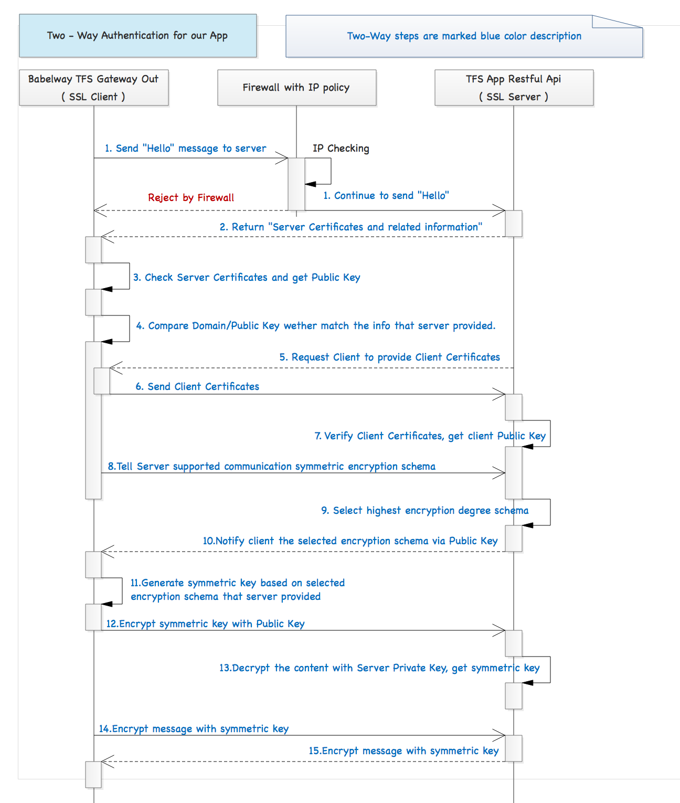

# Two - Way Authenticate

## 1. Workflow



## 2. References

1. [Enable HTTPS in spring-boot](https://drissamri.be/blog/java/enable-https-in-spring-boot/)
2. [Two-way in spring-boot](http://www.robinhowlett.com/blog/2016/01/05/everything-you-ever-wanted-to-know-about-ssl-but-were-afraid-to-ask/#two-way-spring-boot)
3. [Add SSL support to embedded server](https://dzone.com/articles/adding-ssl-support-embedded)
4. [Mutual Authentication ( Two-way ) with spring-boot and tomcat](http://blog.modo.lv/en/post/1825)
5. [SpringBoot Jetty SSL Server Example](https://www.youtube.com/watch?v=oJF13lWN25s)

## 3. Steps with JSSE ( In Java )

JSSE( Java Security Socket Extension ) implemented SSL/TSL protocol. To implement message authentication, we need to focus on following:

* Server Side:
	* KeyStore: stored private key of server
	* Trust KeyStore: stored client certificate of authorization
* Client Side:
	* KeyStore: stored private key of client
	* Trust KeyStore: stored server certificate of authorization

Also you could generate all required files with openssl, but we recommend to use keytool in java.

1. Generate private key of server, and import the key into KeyStore file on server
	
	```
	keytool -genkey -alias serverkey -keystore kserver.keystore
	```
2. Fill required information as following, you can set based on your own requirement, then `kserver.keystore` file will be generated.
	* Enter keystore password
	* Re-enter new password
	* What is your first and last name ?
	* What is the name of your organizational unit ?
	* What is the name or your organization ?
	* What is the name of your City or Locality ?
	* What is the name of your State or Province ?
	* What is the two-letter country code for this unit ?
	* Enter key password for `<alias>` ( RETURN if same as keystore password): 
3. Export the server certificate based on the private key ( generated by step 2 ), here generated server.crt is server certificates.
	
	```
	keytool -export -alias serverkey -keystore kserver.keystore -file server.crt
	```
4. Then import the server certificates into Trust KeyStore of client
	
	```
	keytool -import -alias serverkey -file server.crt -keystore tclient.keystore
	```
5. Then you can do the same steps from 2 ~ 4 and focus on client side
	
	```
	keytool -genkey -alias clientkey -keystore kclient.keystore
	keytool -export -alias clientkey -keystore kclient.keystore -file client.crt
	keytool -import -alias clientkey -file client.crt -keystore kserver.keystore
	```
6. After the steps there should be two grouped files:
	* Stored on Client: kserver.keystore, tserver.keystore
	* Stored on Server: kclient.keystore, tclient.keystore
	
## 4. Implementation in spring-boot


